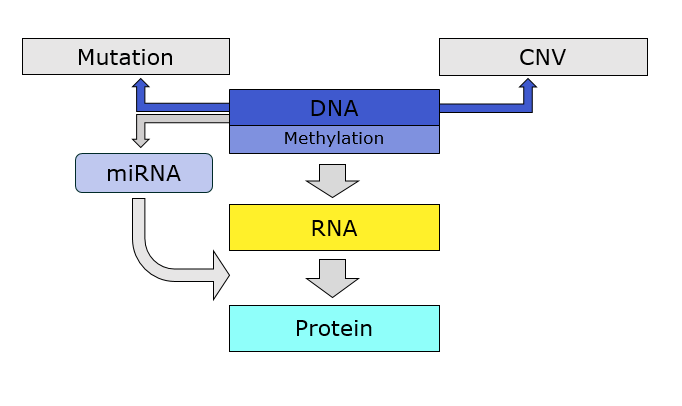
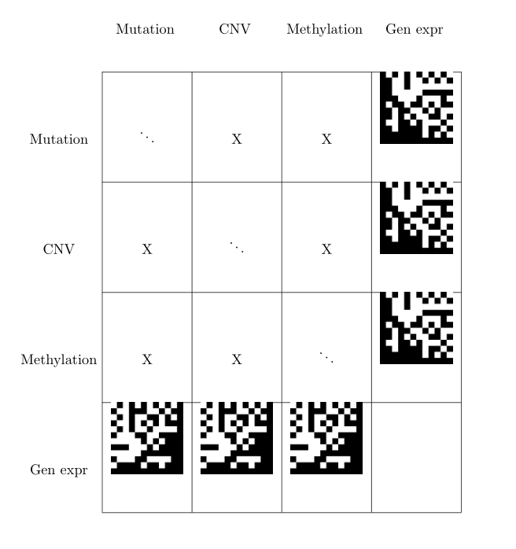
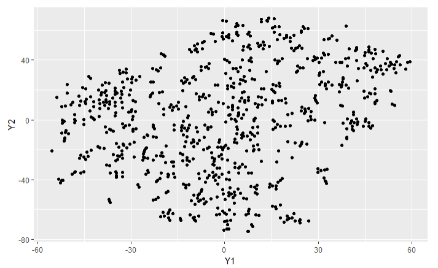

```{r setup, include=FALSE}
knitr::opts_chunk$set(echo = TRUE)
```


## Problem
 
 * lung cancer
 * treatment effectiveness?

## Data {data-transition="slide-out fade-in"}
 


## Data {data-transition="fade"}
 
  * genomic (DNA)
  * transcriptomic (RNA)
  * proteomic (proteins)
  * clinical (treatments outcomes)

## Data {data-transition="fade"}

  * genomic (DNA)
  * transcriptomic (RNA)
  * ~~proteomic (proteins)~~
  * ~~clinical (treatments outcomes)~~
  
## Challenges
  
   * complex data
   * nr of features $\gg$ nr of observations
   * clinical data quality not sufficient to model
   
Can we learn structure from multi-omic data?

## Proposal
   
 * Constrain / reduce data using prior knowledge / assumptions
 * Estimate the sparse $p\times p$ covariance matrix $\Sigma$
 * Construct a distance matrix $d(x,y) = (x-y)^{T}\Sigma^{-1}(x-y)$ with this
 * use distance matrix for dimension reduction


## Step 1: reduction (1)

 1. CNV data set: none
 1. Gene expression: none
 1. Mutation: count number of mutations per gene
 1. Methylation: average beta over probes at $[\text{gene start} - 5000, \text{gene start}  + 5000]$
   + $\text{gene start}$ taken from CNV data set

## Step 1: reduction (2)

 1. Take 1000 variables with highest variance per data set

So pragmatic!
   
## Step 2: covariance

Estimate sparse covariance matrices using the `sparsebn` package*

 * between layers (off-diagonal blocks)
 * hyperparameter $\lambda$, the regularization parameter

Fine-tune the regularization parameter on random subsets: $\lambda_\text{golden} = 5.0000$
  
*Aragam, B., Gu, J., and Zhou, Q. (2017). *Learning large-scale Bayesian networks with the sparsebn package*. arXiv: 1703.04025.

## Step 2: covariance



off-diagonal blockwise sparse covariance $\rightarrow$ distance matrix

## Step 3: distance

Scale-invariant dissimilarity measure, "Mahalonobis distance" 

 $d(x,y) = (x-y)^{T}\Sigma^{-1}(x-y)$

Here, $x$ and $y$ are the length $p$  data vectors of any two patients.

## Step 3: dimension reduction



 t-distributed stochastic neighbour embedding... yeah, that doesn't show much. Perhaps 

 * use all data
 * multidimensional scaling instead of tsne
 * ...

## Discussion {.smaller}

*Advantages*

 * use all of gene-level data
 * simple, just linear algebra
 * sparse estimation suitable for $p\gg n$ data
 * dimension reduction 
   + based on linear 
   + focus on important features

*Disadvantages*
 
 * discards some prior info on data structure
 * assumes blockwise independence network structure 
  
## Speculation

 * 'simple' multilevel hierarchical models
 * regularized/Bayesian 
 * How to combine prior information (pathways?) with data?

